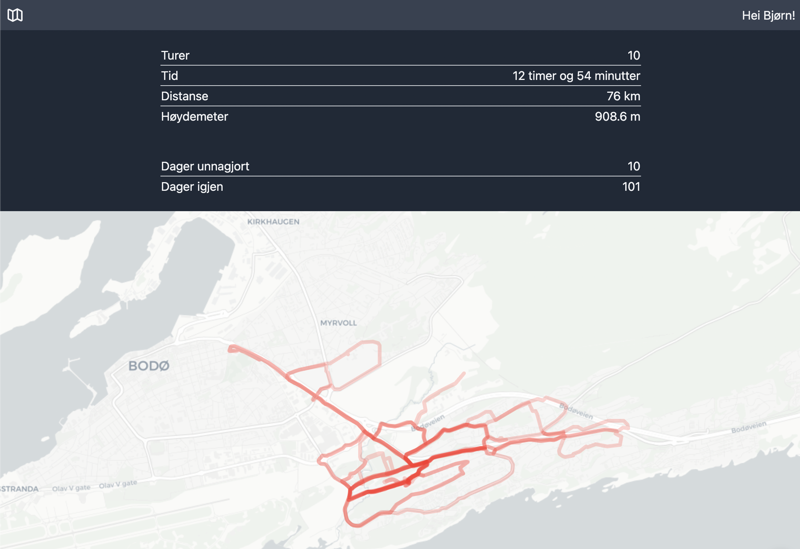

# Pappaperm
Simple app to keep track of how far I've pushed my boy around during my paternal
leave in 2021-2022. I record every walk/run on Strava and this app fetches all
my activities, summarizes some stats and plots all walks/runs on a map. 

Built with [SvelteKit](https://kit.svelte.dev/) and deployed to
[pappaperm.vercel.app](https://pappaperm.vercel.app) by
[Vercel](https://vercel.com).

